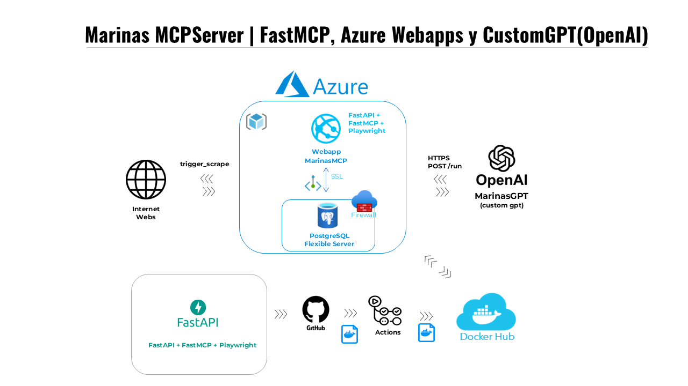

# Marinas MCP

Servidor MCP (FastMCP) para consulta de tarifas de amarres en marinas deportivas, consumido desde un Custom GPT (MarinasGPT_BETA).  
Proyecto en fase muy beta, desarrollado con créditos Azure for Students y suscripción ChatGPT Plus.



## Contenido

- [Características](#características)  
- [Arquitectura](#arquitectura)  
- [Requisitos previos](#requisitos-previos)  
- [Desarrollo local](#desarrollo-local)  
- [Esquema de base de datos](#esquema-de-base-de-datos)  
- [Provisionamiento en Azure](#provisionamiento-en-azure)  
  - [PostgreSQL Flexible Server](#1-postgresql-flexible-server)  
  - [App Service para contenedor Docker](#2-azure-app-service-contenedor-docker)  
  - [Configuración de la Web App](#configuración-de-la-web-app)  
- [Uso de la API](#uso-de-la-api)  
- [CI/CD](#cicd)  
- [Licencia](#licencia)  

## Características

- Extracción de tarifas desde HTML o PDFs de tres marinas: Benalmádena, Marbella y Marina del Este.
- API MCP con herramientas:
  - `trigger_scrape`: fuerza actualización de datos.
  - `list_marinas`: lista IDs disponibles.
  - `get_marina_content(marina_id)`: recupera tarifas JSON y texto PDF.
  - `list_history_dates(marina_id)`, `get_marina_history(marina_id)`: histórico.
- Despliegue de contenedor Docker en Azure App Service.
- Base de datos PostgreSQL Flexible Server en Azure.

## Arquitectura

- **Cliente**: Custom GPT o cualquier cliente HTTP.
- **Azure App Service**: ejecuta contenedor Docker con FastAPI + FastMCP.
- **PostgreSQL Flexible Server**: almacena `marinas` y `marinas_history`.
- **Conectividad**:
  - Endpoint público para la App Service.
  - Endpoint público para la DB (`0.0.0.0/0`) con reglas de firewall (IP propia y Azure).
  - CORS habilitado para `https://chat.openai.com`.


## Requisitos previos

- Azure CLI instalada y logueada (`az login`)
- Docker y cuenta en Docker Hub
- Python 3.10+ y entorno virtual
- Variables de entorno en `.env`:

```dotenv
DATABASE_URL="postgresql://pgadmin@marinas-pg:5432/marinasdb?sslmode=require"
```

## Desarrollo local

```bash
git clone https://github.com/tu_usuario/marinas-mcp.git
cd marinas-mcp
python -m venv venv
source venv/bin/activate      # Windows: venv\Scripts\activate
pip install -r requirements.txt
cp .env.example .env          # ajustar cadena de conexión
uvicorn server:app --reload
```

## Esquema de base de datos

Conéctese al servidor PostgreSQL (Azure Cloud Shell o local):

```bash
psql "host=<SERVER>.postgres.database.azure.com port=5432 dbname=marinasdb user=pgadmin sslmode=require"
```

Ejecute:

```sql
CREATE TABLE IF NOT EXISTS marinas (
  id           TEXT PRIMARY KEY,
  pdf_text     TEXT,
  tarifas_json JSONB,
  updated_at   TIMESTAMPTZ NOT NULL
);

CREATE TABLE IF NOT EXISTS marinas_history (
  id           TEXT NOT NULL,
  pdf_text     TEXT,
  tarifas_json JSONB,
  updated_at   TIMESTAMPTZ NOT NULL
);

CREATE INDEX IF NOT EXISTS idx_marinas_history_id_date
  ON marinas_history(id, updated_at DESC);
```

## Provisionamiento en Azure

### 1. PostgreSQL Flexible Server

```bash
az postgres flexible-server create \
  --resource-group marinas-rg \
  --name marinas-pg \
  --location westeurope \
  --admin-user pgadmin \
  --admin-password "<PASSWORD>" \
  --sku-name Standard_B1ms \
  --tier Burstable \
  --version 14 \
  --storage-size 32 \
  --public-access 0.0.0.0/0

az postgres flexible-server db create \
  --resource-group marinas-rg \
  --server-name marinas-pg \
  --database-name marinasdb

# Firewall: tu IP
az postgres flexible-server firewall-rule create \
  --resource-group marinas-rg \
  --server-name marinas-pg \
  --rule-name allow_my_ip \
  --start-ip-address <MY_IP> \
  --end-ip-address <MY_IP>

# Firewall: servicios Azure
az postgres flexible-server firewall-rule create \
  --resource-group marinas-rg \
  --server-name marinas-pg \
  --rule-name allow_azure_services \
  --start-ip-address 0.0.0.0 \
  --end-ip-address 0.0.0.0
```

### 2. Azure App Service (Contenedor Docker)

```bash
az group create \
  --name marinas-rg \
  --location westeurope

az appservice plan create \
  --resource-group marinas-rg \
  --name marinas-plan \
  --is-linux \
  --sku B1

az webapp create \
  --resource-group marinas-rg \
  --plan marinas-plan \
  --name marinas-mcp-app \
  --deployment-container-image-name <DOCKERHUB_USER>/marinas-mcp-app:latest
```

## Configuración de la Web App

```bash
# Variables de entorno
az webapp config appsettings set \
  --resource-group marinas-rg \
  --name marinas-mcp-app \
  --settings \
    DATABASE_URL="<TU_CADENA_CONN_SIN_CREDENCIALES>" \
    WEBSITES_PORT=8000

# Always On
az webapp config set \
  --resource-group marinas-rg \
  --name marinas-mcp-app \
  --always-on true

# CORS
az webapp cors add \
  --resource-group marinas-rg \
  --name marinas-mcp-app \
  --allowed-origins https://chat.openai.com

# Logging
az webapp log config \
  --resource-group marinas-rg \
  --name marinas-mcp-app \
  --docker-container-logging filesystem \
  --detailed-error-messages true \
  --failed-request-tracing true

az webapp log tail \
  --resource-group marinas-rg \
  --name marinas-mcp-app

# (Opcional) Arrancar / detener base de datos
az postgres flexible-server stop  -g marinas-rg -n marinas-pg
az postgres flexible-server start -g marinas-rg -n marinas-pg
```

## Uso de la API

Acceda a los endpoints:

- `GET /` → `{ "status":"ok" }`
- `POST /run`

Ejemplos de payload:

```json
{ "name":"trigger_scrape" }
{ "name":"list_marinas" }
{ "name":"get_marina_content", "marina_id":"benalmadena" }
```

Consulte `/docs` para explorar OpenAPI y Swagger UI.

## CI/CD

En esta PoC se utiliza GitHub Actions para compilar y publicar la imagen Docker en Docker Hub.  
El flujo de trabajo se dispara al hacer push en `main`, y **no** cubre despliegue automático en Azure.

## Licencia

MIT (o la que decidas)
